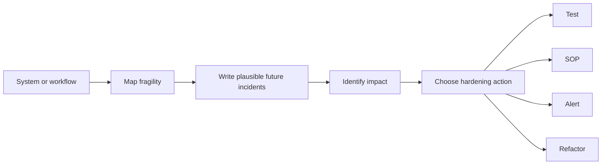

# failure-map

A reusable AI prompt and structured review skill for identifying realistic failure scenarios before they cost you money, time, or trust.

Built around the philosophy behind [The Cartographer Method](https://allentcampbell.com): map before you build, because the failure modes are already there. You just haven't named them yet.

---

## What It Does

failure-map walks through any system - code, workflow, automation, or AI deployment - and produces a structured failure analysis written as if the incidents have already happened.

Not a bug hunt. Not a security audit. A pre-mortem exercise that surfaces what a future editor, operator, or API change could break without realizing it.

It works beyond code. That's the point.

| Domain | Examples |
| --- | --- |
| Code and APIs | ordering dependencies, shared state, version-coupled behavior |
| Business workflows | handoff gaps, approval bypass, scope drift |
| Automation systems | trigger-state coupling, silent failures, retry storms |
| AI deployments | hallucination surface, memory staleness, overreach risk |
| Data pipelines | trust drift, null propagation, transformation assumptions |

---

## Why This Exists

Most systems don't break because someone made an obvious mistake. They break because someone made a reasonable change without knowing what depended on the thing they touched.

failure-map forces that question before the change happens.

---

## How Failure Map Works



---

## File Structure

```
failure-map/
├── README.md
├── LICENSE.md
├── prompts/
│   └── failure-map.md        <- the main prompt
└── examples/
    ├── content-publishing-workflow.md
    ├── ecommerce-erp-sync.md
    └── ai-memory-layer.md
```

---

## How to Use It

failure-map is a prompt-based skill. Run it with Claude, ChatGPT, or any capable LLM that supports long-context instruction following.

1. Open `prompts/failure-map.md`
2. Give the AI the system you want reviewed - paste code, describe a workflow, share a process doc, or describe an automation
3. Let it map the failure surface
4. Use the output to decide what becomes a test, an SOP, an alert, or a refactor

No special tooling required. The output is a markdown report you keep alongside the system it documents.

---

## Examples

See the `/examples` folder for worked failure maps across three real-world scenarios:

- **content-publishing-workflow.md** - An AI-assisted content creation, review, scheduling, and distribution workflow
- **ecommerce-erp-sync.md** - An ecommerce-to-ERP order sync integration
- **ai-memory-layer.md** - A persistent memory layer for an AI agent system

---

## Attribution

Originally inspired by Matthew Honnibal's `claude-skills` pre-mortem command, then rewritten and expanded for operational workflow, AI, and systems-integration review.

---

## License

MIT. Use it, fork it, adapt it.

---

Built by Todd Campbell  
[Allen T. Consulting](https://allentcampbell.com)  
The Cartographer Method: Map. Stabilize. Deploy.
